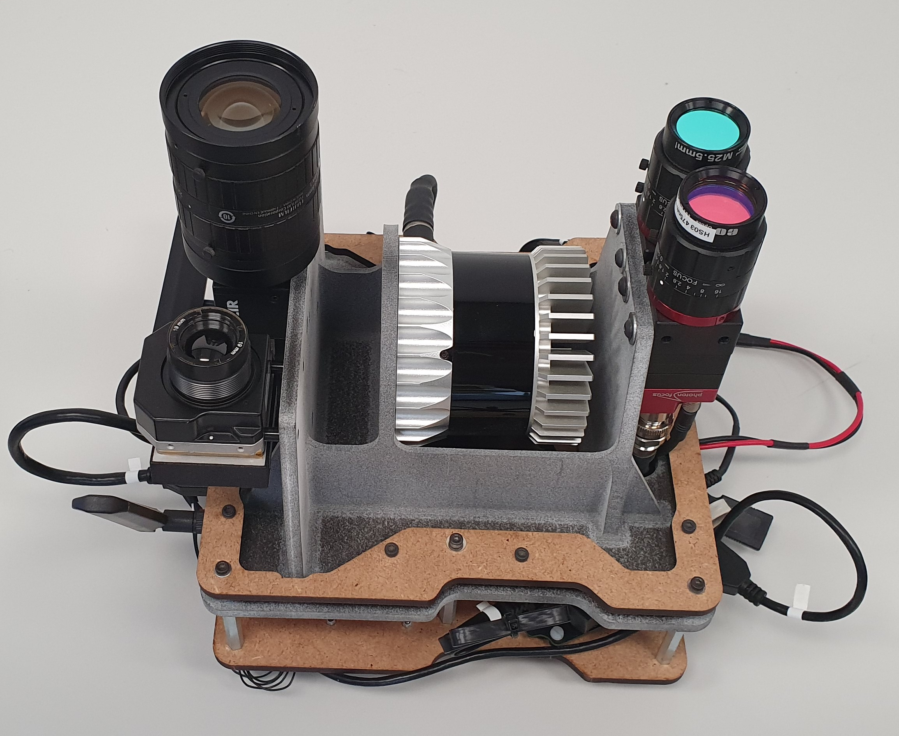

# swisssmartfarming
Repository containing code related to the *Swiss Smart Farming* Project (*SSF*).

## The Project
Within the context of the project *Swiss Smart Farming* various agricultural datasets were collected. For the collection of the datasets the custom sensor-pod shown here was used:



The SSF sensor-pod integrates the following sensors and cameras:
* RGB camera:
* VIS camera:
* NIR camera
* thermal camera:
* Lidar:

## Dependencies
Agricultural datasets captured for this project include RGB, hyperspectral, thermal as well as lidar data.
Datasets were stored as [bagfiles](http://wiki.ros.org/Bags), a file format in [ROS](https://www.ros.org/) for storing *ROS message data*.
The use of the package assumes that you have ROS installed on your system. The package was developed and tested under *Ubuntu 18.04 LTS* with the *ROS Melodic Morenia* distribution.

Many of the geodata operations performed within the project rely on the use of GDAL. GDAL, as well as the Python binding ``pygdal`` have to be installed on the computer. In order for the installation of ``pygdal`` to be successful, its version has to match the GDAL version. Check the installed GDAL version with ``gdal-config --version``. If the GDAL version is e.g. 2.2.3, then ``pygdal==2.2.3.X`` has to be installed, where ``X`` matches one of the available ``pygdal`` versions.

The script `setup.bash` does all of the setup required in order to use the package. To successfully run it, the following dependences are required:

[x] `gdal-bin`
[] `build-essential`
[] `git`
[] `libboost-python-dev`
[] `libexiv2-dev`
[] `libimage-exiftool-perl`
[] `python-all-dev`
[] `python-pip`
[] `python3-venv`
[] `virtualenv` (`pip2 install --user virtualenv`)

Under *Ubuntu* those can be installed with `sudo apt install build-essential git libboost-python-dev libexiv2-dev libimage-exiftool-perl python-all-dev python-pip python3-venv; pip2 install --user virtualenv`.

After the installation of these main dependencies the `setup.bash` script can be sourced (`source setup.bash`). This performs the needed setup.
The script has to be sourced with one of the following three options:
1. `--py2`
2. `--py3`
3. `--all`

Option 1. performs the setup necessary to run `python2` scripts. Only the script `processing/process_pix4d.py` uses `python2`. This is because within the project stitching of the dataset was performed under *Ubuntu 14.04* and `python3-venv` was causing trouble there. This option just creates a virtualenv `venv2` and installs there all of the packages contained in `requirements_py2.txt`, needed to run `processing/process_pix4d.py`. If you are not going to stitch datasets using [Pix4D](https://www.pix4d.com/) with this computer, then you don't need this.
Option 2. does the same with `python3`, it creates the virtualenv `venv3` and installs there the packages listed in `requirements_py3.txt`, necessary to run all of the other scripts. Moreover, this option performs configurations necessary in order to use *ROS* with `python3`. In particular, the ROS-package `cv_bridge` throws errors when run with `python3`. Therefore, this option recompiles the `cv_bridge` package making it usable under `python3`.
Finally, option 3. combines the two setups, it is equivalent to running `source setup.bash --py2; source setup.bash --py3`.


### python2
* rootpath==0.1.1


### python3
* catkin-pkg==0.4.16
* Fiona==1.8.13
* geopandas==0.7.0
* matplotlib==3.1.3
* numpy==1.15.2
* opencv-python==4.2.0.32
* pandas==0.23.4
* Pillow==7.0.0
* pycryptodomex==3.9.7
* pygdal==2.2.3.6
* py3exiv2==0.7.1<sup>1</sup>
* PyYAML==5.1
* rasterio==1.1.2
* roipoly==0.5.2
* rosbag==1.14.5
* rospkg==1.2.4
* rootpath==0.1.1
* scipy==1.1.0
* seaborn==0.10.0
* Shapely==1.7.0
* spectral==0.20

1. `py3exiv2` depends on: `build-essential`, `python-all-dev`, `libexiv2-dev`, `libboost-python-dev`

## Usage
There are two main command line tools that can be used in order to process an SSF-dataset. The first one is `preprocess_bag.py` and the second one is `process_pix4d.py`, both are located under the `processing` module.

`preprocess_bag.py` depends on many packages that were installed with `setup.bash`. In order for them to be available the virtual environment has to be activated with `source venv3/bin/activate`. After activating the virtual environment run `processing/preprocess_bag.py -h` in order to get a description on how to use it.

### preprocess_bag.py
`processing/preprocess_bag.py --bagfile /path/to/bagfile.bag --ref_panel {1,2,3}`

Preprocesses an SSF-rosbag dataset.

Given a rosbag file containing a dataset for the Swiss Smart Farming
Project performs the preprocessing steps on the raw images.
The preprocessed images will be stored under the folder 'frames',
located one level higher than the bagfile.

Preprocessing steps include:

1. for RGB images: save them in 'jpg' format and embed the image
metadata (camera name, focal length, GPS location, ...)

2. for hyperspectral images:
    1. reshape the raw image to an image cube according to the specifications from the xml calibration file
    2. apply a 3x3 median filter in order to smoothen the image
    3. converts the images from 8-bit (0-255) to reflectance (0-100%). For this an image of a

All images captured are
stored under a 'topic'. Check 'cfg/cameras' to see all the cameras used
for the project and the corresponding topic.

If a new camera had to be integrated into the system, a new camera
configuration file need to be added, in order to extract and preprocess
the new camera. Under 'cfg/cameras' add a folder named 'camera-name_camera-type' and
under it a text file with the same name and extension '.cfg'. This file
gives some specifications about the camera. Compare (and copy) e.g.
'cfg/cameras/blackfly_rgb/blackfly_rgb.cfg' in order to create a new
camera configuration file. The 'exp_t_topic' field in the file can be
empty, if the exposure time of the camera is not being recorded.

If the value of the field 'type' is 'hyperspectral', then a second text
file (.xml) is expected under the camera folder. The name of the file
does not matter. This file contains information about the hyperspectral
sensor and is unique for every single sensor produced. It has to be
handed in at the purchase of every hyperspectral camera and a copy need
to be stored together with the camera configuration file in order to
make the hyperspectral processing possible.


### process_pix4d.py

## Datasets Structure
All the SSF datasets have the structure shown in the following diagram. The root
folder name is the name of the field. The dataset is split into dates at which
the flights were carried out. These are saved directly under the root folder.
Under every date-folder the following can be found:
* ``bagfile.bag``: symbolic link to the dataset source
[bagfile](http://wiki.ros.org/Bags "ROS - Bags")
* ``bagfile.info``: result of the command ``rosbag info <bagfile.bag>`` saved
to a text-file
* ``rtk_data.csv``: file containing the recorded RTK-GPS positions / altitudes
* camera-folders: can be ``nir``, ``rgb``, ``thermal`` or ``vis``. ``thermal``
is shown in brackets since not all flights were performed with a thermal camera.
All camera-folders have the same substructure:
    - ``frames``: folder containing the camera frames extracted from the
    bagfile. The file ``img_tstamps.csv`` also stored here contains the
    timestamp of every frame
    - ``field-name_date-1_nir``: folder with the standard
    [Pix4D folder structure](https://support.pix4d.com/hc/en-us/articles/202558649-Project-Folder-Structure "Pix4D - Project Folder Structure").
    All Pix4D outputs (mosaics, point clouds, DSM, ...) are saved under this
    directory
    - ``field-name_thermal.p4d``: standard Pix4D project file that can be
    imported into Pix4D in order to regenerate / modify some outputs

```
field-name
├── date-1
│   ├── bagfile.bag
│   ├── bagfile.info
│   ├── rtk_data.csv
│   ├── nir
│   │   ├── frames
│   │   │   ├── frame-1.tif
│   │   │   ├── frame-n.tif
│   │   │   └── img_tstamps.csv
│   │   ├── field-name_date-1_nir
│   │   └── field-name_date-1_nir.p4d
│   ├── rgb
│   │   ├── frames
│   │   │   ├── frame-1.jpg
│   │   │   ├── frame-n.jpg
│   │   │   └── img_tstamps.csv
│   │   ├── field-name_date-1_rgb
│   │   └── field-name_date-1_rgb.p4d
│   ├── (thermal)
│   │   ├── frames
│   │   │   ├── frame-1.tif
│   │   │   ├── frame-n.tif
│   │   │   └── img_tstamps.csv
│   │   ├── field-name_date-1_vis
│   │   └── field-name_date-1_vis.p4d
│   └── vis
│       ├── frames
│       │   ├── frame-1.tif
│       │   ├── frame-n.tif
│       │   └── img_tstamps.csv
│       ├── field-name_date-1_vis
│       └── field-name_date-1_vis.p4d
└── date-n
    ├── bagfile.bag
    ├── bagfile.info
    ├── rtk_data.csv
    ├── nir
    │   ├── frames
    │   │   ├── frame-1.tif
    │   │   ├── frame-n.tif
    │   │   └── img_tstamps.csv
    │   ├── field-name_date-n_nir
    │   └── field-name_date-n_nir.p4d
    ├── rgb
    │   ├── frames
    │   │   ├── frame-1.jpg
    │   │   ├── frame-n.jpg
    │   │   └── img_tstamps.csv
    │   ├── field-name_date-n_rgb
    │   └── field-name_date-n_rgb.p4d
    ├── (thermal)
    │   ├── frames
    │   │   ├── frame-1.tif
    │   │   ├── frame-n.tif
    │   │   └── img_tstamps.csv
    │   ├── field-name_date-n_thermal
    │   └── field-name_date-n_thermal.p4d
    └── vis
        ├── frames
        │   ├── frame-1.tif
        │   ├── frame-n.tif
        │   └── img_tstamps.csv
        ├── field-name_date-n_vis
        └── field-name_date-n_vis.p4d
```

## Downloads
* [Presentation: Microsoft Smart Farming Workshop](doc/presentations/SSF_Microsoft.pdf)

## See also
* [Hemp-Segmentation](https://github.com/dschori/Hemp-Segmentation)
